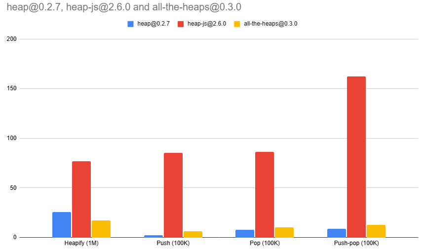
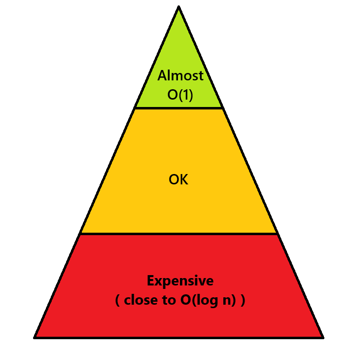
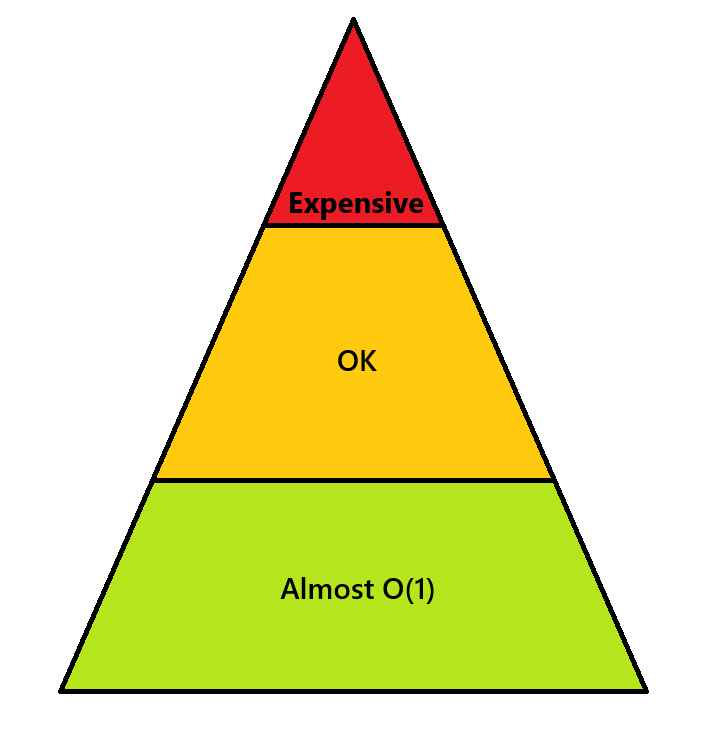

# All the heaps!


[](https://codecov.io/github/BeatsuDev/all-the-heaps)

All the heaps exports several different heap implementations so that you can
"plug in" any implementation you want while using the same interface. Some heaps
might be faster in some cases, so instead of rewriting your code to check every
implementation, just swap out the implementation that you import!

```ts
import { BinaryHeap as Heap } from "all-the-heaps";

const heap = new Heap();
```

```ts
import { NAryHeap as Heap } from "all-the-heaps";

const heap = new Heap();  // Voilá! You now have a tertiary heap by default
const heap = new Heap(10) // Or a 10-ary heap.
```


## Installation
```
npm i all-the-heaps
```

## Usage
```ts
import { BinaryHeap } from "all-the-heaps";

// Create from array
const heap = BinaryHeap.from([3, 2, 1]);

// Min heap
const heap = new BinaryHeap();

// Max heap
const heap = new BinaryHeap((a, b) => b - a);

// Custom data types
type Dog = { name: string };
const heap = new BinaryHeap<Dog>((a, b) => a.name.length - b.name.length);

// Pushing, popping and peeking
heap.push({ name: "Woofy" });
heap.peek() // { name: "Woofy" }
heap.pop() // { name: "Woofy" }

heap.peek() // undefined
heap.pop() // undefined
```

## Roadmap
- [x] Binary heap
- [x] D-ary heap
- [ ] Skew heap
- [ ] Binomial heap
- [ ] Pairing heap
- [ ] Fibonacci heap
- [ ] Brodal heap

## Performance

Here's a performance comparison over the most popular heap packages and all-the-heaps. `heap` is 
currently the fastest - *for now* 😉.



Do you want to make your own fast heap implementation? Or perhaps you're just curious what tricks
have been done to make this implementation fast? Here's what I've learned!

Assume a min-heap (a heap with its smallest values at the top of the heap).

Terminology:\
- Heap property || Every node's children is larger or equal to the node itself.
- Sift-down || Move a node down by swapping it with its smaller child until the heap property is restored.
- Sift-up || Same as sift-down, but moving the node up the heap instead
- Heapify || Creating a heap from an array of numbers

### Use an array instead of nodes

Conceptually, the heap is a tree of nodes pointing to each other. However, binary heaps are *complete
binary trees*, so we can represent them as a filled array without any empty spaces, and then calculate
the children / parent values without any pointers. This saves memory space (no pointer required) and
also increases performance, because we're working with contiguous memory which is much easier to cache
and predict read/write patterns for.

> 
> [From Wikipedia page for Binary Heap](https://en.wikipedia.org/wiki/Binary_heap)

### Sift down instead of insert in heapify

Sift up is expensive for nodes at the bottom of the tree, because they can potentially be swapped all
the way to the top of the heap. Likewise, sift down is expensive for nodes at the top of the tree because
they can be swapped all the way to the bottom of the tree. However, in a binary heap, half the nodes are
leaf nodes. Half of them!! In other words, there are way more nodes at the bottom of the heap than at
the top, so it would make sense to use operations that are cheap for the bottom nodes.

> 
> Operation cost for sift up in a heap. Compare this to the sift down operation:
> 

So, start at index `Math.floor(heap.length / 2) - 1` and sift down all nodes down to index `0`.
Voilà, a heap in `O(n)`. [Here's a longer explanation showing why this is O(n)](https://stackoverflow.com/a/18742428/8594404).

### Don't swap, move a "hole" instead

Conceptually sift up and sift down swaps nodes up/down. However, instead of actually performing a swap
at each level, you can store the moving value separately, and only move the other node.

Take moving C in this example (the `^` points at the two nodes we are comparing)
```
C -> A -> B -> D
^    ^
A -> C -> B -> D (two assignments)
     ^    ^
A -> B -> C -> D (two assignments)
          ^    ^
```
Instead, let's store C separately and move a conceptual hole. In the example below, the `h` points at
the "hole" where we might insert C to and `^` points to the value we compare C to. While C is not at
the right place, we fill the hole with the value at `^` and move on. 
```
C -> A -> B -> D\
h    ^
A -> A -> B -> D (one assignment)\
     h    ^
A -> B -> B -> D (one assignment)\
          h    ^
A -> B -> C -> D (one assignment)
```
[Here's the Rust implementation and their explanation.](https://doc.rust-lang.org/src/alloc/collections/binary_heap/mod.rs.html#661-668)
[And here's Python's implementation (they swapped the name siftup/siftdown).](https://github.com/python/cpython/blob/main/Lib/heapq.py#L207-L219)
