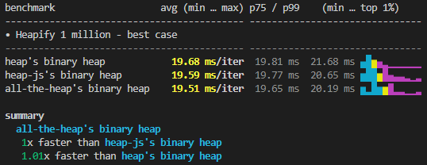
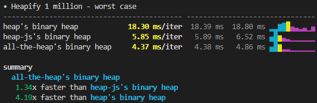
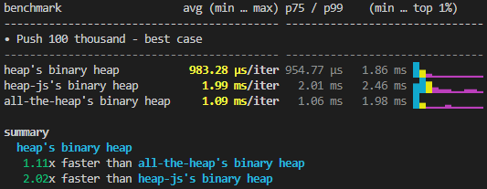
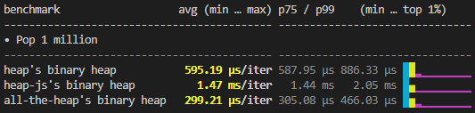
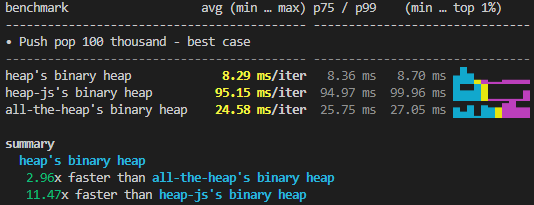
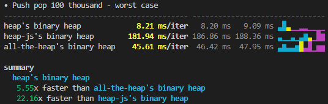

# Library benchmarks

This directory contains benchmarks comparing all-the-heaps implementations with other popular libraries.
[Mitata](https://github.com/evanwashere/mitata) is used to benchmark and compare the heaps.

A lot of these results are very surprising to me. This is also the first time I'm benchmarking JS code,
so the results should therefore be used tentatively. Please give me feedback if you think these benchmarks
are misconfigured, of poor quality, or could be improved in any way!

If you have experience with profiling Javascript library code, I would love you to share you experience 
and which tools you use. Leave a comment in the
[first announcement discussion posted to the GitHub repo](https://github.com/BeatsuDev/all-the-heaps/discussions/1).

## Run the benchmarks

> Note: Ensure you have installed all dependencies to run the benchmarks.

```
bun --expose-gc --allow-natives-syntax bench/<heap-type>/<benchmark>.ts
```

## Results

### (Binary Heap) Heapify

**System: (ran on WSL)**
```
clk: ~3.42 GHz
cpu: AMD Ryzen 7 5700U with Radeon Graphics
runtime: bun 1.2.10 (x64-linux)
```

Best case in this sense is heapifying an array of ascending numbers (no swaps required).
Worst case is heapifying an array of descending numbers (max swaps required).

**Best case**\
`heap@0.2.7`: 19.50ms / iteration\
`heap-js@2.6.0`: 19.20ms / iteration\
`all-the-heaps@0.3.0`: 19.16ms / iteration



**Worst case**\
`heap@0.2.7`: 18.30ms / iteration\
`heap-js@2.6.0`: 5.85ms / iteration\
`all-the-heaps@0.3.0`: 4.37ms / iteration



### (Binary Heap) Push

**System: (ran on WSL)**
```
clk: ~1.75 GHz
cpu: AMD Ryzen 7 5700U with Radeon Graphics
runtime: bun 1.2.10 (x64-linux)
```

Best case: pushing numbers in ascending order
Worst case: pushing numbers in descending order

**Best case**\
`heap@0.2.7`: 970.61µs / iteration\
`heap-js@2.6.0`: 2.01ms / iteration\
`all-the-heaps@0.3.0`: 868.43µs / iteration\



**Worst case**\
`heap@0.2.7`: 2.18ms / iteration\
`heap-js@2.6.0`: 101.64ms / iteration\
`all-the-heaps@0.3.0`: 7.53ms / iteration


### (Binary Heap) Pop

**System: (ran on WSL)**
```
clk: ~4.07 GHz
cpu: AMD Ryzen 7 5700U with Radeon Graphics
runtime: bun 1.2.10 (x64-linux)
```

`heap@0.2.7`: 4.74ms / iteration\
`heap-js@2.6.0`: 12.06ms / iteration\
`all-the-heaps@0.3.0`: 2.39ms / iteration



### (Binary Heap) Push & pop

**System: (ran on WSL)**
```
clk: ~3.40 GHz
cpu: AMD Ryzen 7 5700U with Radeon Graphics
runtime: bun 1.2.10 (x64-linux)
```

Best case: pushing numbers in ascending order
Worst case: pushing numbers in descending order

**Best case**\
`heap@0.2.7`: 8.10ms / iteration\
`heap-js@2.6.0`: 103.13ms / iteration\
`all-the-heaps@0.3.0`: 9.73ms / iteration



**Worst case**\
`heap@0.2.7`: 8.29ms / iteration\
`heap-js@2.6.0`: 182.40ms / iteration\
`all-the-heaps@0.3.0`: 10.42ms / iteration


